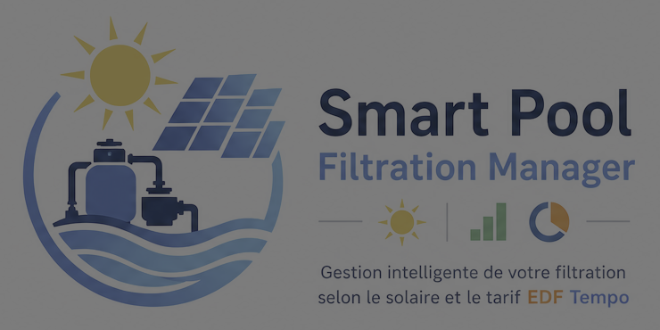

<div align="center">

# 🏊 Smart Pool Filtration Manager — Custom Component Home Assistant




**Contrôle intelligent de la pompe de filtration de la piscine.**

 [](https://github.com/custom-components/hacs)  

[](https://GitHub.com/pvergezac/smartpoolfiltrationmanager/releases/)

[]()
[](https://github.com/pvergezac/smartpoolfiltrationmanager/blob/master/LICENSE)
[](https://GitHub.com/pvergezac/smartpoolfiltrationmanager/network/)

[](https://GitHub.com/pvergezac/SmartPoolFiltrationManager/stargazers/)


</div>

---

## 📋 Description

**Smart Pool Filtration Manager** est une intégration personnalisée pour **Home Assistant** qui permet de controler la pompe de filtration de la piscine selon la **température de l'eau**, la **production solaire photovoltaïque**, la couleur du jour et plage horaire **EDF Tempo** (intégration RTE Tempo nécessaire) afin d'optimiser l'utilisation de l'energie solaire et des tarifs préférentiels, tout en privilégiant les autres besoins en energie de la maison.

---

## ✨ Fonctionnalités

- ⏱️ **Durée calculée automatiquement** selon la règle T°/2 (ex : 24°C → 6h de filtration)
- ☀️ **Priorité solaire** : la pompe tourne en priorité quand les panneaux produisent suffisamment
- **Priorité ECS** : la chauffe du ballon ECS peut être priorisé si sa température est disponible (en option)
- **Seuils Marche/Arret pompe** : controle de la pompe en fonction de la puissance solaire et de la consomation réseau
- **Couleur TEMPO** : limite de consommation réseau en fonction de la couleur du jour TEMPO (en option)
- 🔋 **Complétion intelligente** : si la production solaire ne suffit pas, complète sur le réseau en fin de journée
- 📊 **Suivi journalier** : durée filtrée, contribution solaire, progression
- 🔧 **4 modes de fonctionnement** : Automatique, Solaire uniquement, Manuel, Arrêt forcé
- 💾 **Persistance** : les compteurs survivent aux redémarrages de HA

---

## 📦 Installation via HACS (recommandé)

[](https://my.home-assistant.io/redirect/hacs_repository/?owner=pvergezac&repository=SmartPoolFiltrationManager=integration)

### Prérequis

- Home Assistant version 2025.2.4 ou supérieure
- [HACS installé](https://hacs.xyz/docs/setup/download) sur votre instance Home Assistant

### Étape 1 — Ajouter le dépôt personnalisé dans HACS

> HACS ne référence pas encore ce dépôt par défaut. Ajoutez-le manuellement.

1. Dans Home Assistant, ouvrez **HACS** dans la barre latérale
2. Cliquez sur les **⋮** (trois points) en haut à droite
3. Sélectionnez **Dépôts personnalisés**
4. Dans le champ **Dépôt**, saisissez l'URL du dépôt GitHub :
   ```
   https://github.com/pvergezac/SmartPoolFiltrationManager
   ```
5. Dans **Catégorie**, sélectionnez **Intégration**
6. Cliquez sur **Ajouter**

### Étape 2 — Installer l'intégration

1. Toujours dans HACS, allez dans **Intégrations**
2. Cliquez sur **+ Explorer et télécharger des dépôts**
3. Recherchez **Smart Pool Filtration Manager**
4. Cliquez sur le résultat puis sur **Télécharger**
5. Confirmez en cliquant sur **Télécharger** dans la fenêtre de confirmation

### Étape 3 — Redémarrer Home Assistant

Après l'installation, un redémarrage est nécessaire :

**Paramètres → Système → Redémarrer → Redémarrer Home Assistant**

Attendez que Home Assistant soit complètement redémarré avant de continuer.

## 🔧 Installation Manuel

1. Copier le dossier `custom_components/smartpoolfiltmgr/` dans votre dossier `config/custom_components/`
2. Redémarrer Home Assistant

---

## ⚙️ Configuration

### Étape 1 — Ajouter l'intégration

**Paramètres → Appareils et services → Ajouter une intégration → Smart Pool Filtration Manager**

Renseignez :
| Champ | Description | Exemple |
|-------|-------------|---------|
| Switch de la pompe | Entité switch qui allume/éteint la pompe | `switch.pompe_piscine` |
| Température de l'eau | Sonde de température dans le bassin | `sensor.temperature_piscine` |
| Production solaire | Puissance instantanée des panneaux (W) | `sensor.solaire_puissance` |
| Consommation réseau | Puissance soutirée au réseau (optionnel) | `sensor.consommation_reseau` |

### Étape 2 — Options avancées

Accessible via le bouton **Configurer** sur la carte de l'intégration :

| Option                      | Défaut     | Description                                   |
| --------------------------- | ---------- | --------------------------------------------- |
| Heure de réinitialisation   | 6 h        | la journée de filtration (fin des HC de nuit) |
| Durée minimale/jour         | 2 h        | Garantie même si température froide           |
| Durée maximale/jour         | 12 h       | Plafond absolu                                |
| Plage solaire - début       | 8 h        | Début de la filtration sur production solaire |
| Plage solaire - fin         | 20 h       | Fin de la filtration sur production solaire   |
| Puiss solaire min           | 500 W      | Solaire minimum pour autoriser la pompe       |
| Temp Bollon ECS min         | 40°        | Temp ballon minimum pour autoriser la pompe   |
| Hystérésis ECS              | 2°         | Ecart min pour éviter les oscilations         |
| Conso max démarrage pompe   | 50 W       | Seuil de démarrage                            |
| Conso max arret pompe       | 500 W      | Seuil conso max (jour BLEU ou sans TEMPO)     |
| Conso max arret pompe BLANC | 100 W      | Seuil conso max (jour BLANC)                  |
| Conso max arret pompe       | 50 W       | Seuil conso max (jour ROUGE)                  |
|                             |            |                                               |
| Plage compl réseau - début  | 22 h       | Début de complément de filtration (nuit)      |
| Plage solaire - fin         | 6 h        | Fin de complément de filtration (nuit)        |
| Complément réseau           | ✅         | Validé (jour BLEU ou sans TEMPO)              |
| Complément réseau BLANC     | ❌         | Validé (jour BLANC)                           |
| Complément réseau ROUGE     | ❌         | Validé (jour ROUGE)                           |

---

## Entités créées

### Capteurs

| Entité                                        | Description                                  |
| --------------------------------------------- | -------------------------------------------- |
| `sensor.pool_filtration_duree_journaliere`    | Minutes de filtration effectuées aujourd'hui |
| `sensor.pool_filtration_duree_cible`          | Durée cible calculée selon T° de l'eau       |
| `sensor.pool_filtration_contribution_solaire` | Minutes filtrées grâce au solaire            |
| `sensor.pool_filtration_mode`                 | Mode actif + état détaillé                   |

### Contrôles

| Entité                                  | Description                                                |
| --------------------------------------- | ---------------------------------------------------------- |
| `select.pool_filtration_mode`           | Sélecteur de mode (Automatique / Solaire / Manuel / Arrêt) |
| `switch.pool_filtration_forcage_manuel` | Force la pompe ON (passe en mode Manuel)                   |

---

## Logique de décision

```
Toutes les 60 secondes :
│
├─ Mode MANUEL ?     → respecter l'état du switch manuel
├─ Mode ARRÊT ?      → pompe OFF
├─ Quota atteint ?   → pompe OFF (durée cible dépassée)
├─ Hors plage horaire ? → pompe OFF
│
├─ Mode SOLAIRE ?
│   └─ Production >= seuil → pompe ON
│
└─ Mode AUTO (défaut) :
    ├─ Solaire dispo → pompe ON ☀️
    └─ Pas de solaire :
        ├─ Temps restant > estimation solaire → pompe ON (réseau) 🔌
        └─ Sinon → pompe OFF (attendre le solaire)
```

### Table de durée selon température

| Température | Durée de filtration |
| ----------- | ------------------- |
| ≤ 10°C      | 1 h                 |
| 15°C        | 2 h                 |
| 20°C        | 4 h                 |
| 24°C        | 6 h                 |
| 28°C        | 9 h                 |
| ≥ 30°C      | 12 h                |

_(Interpolation linéaire entre les points)_

---

## Tableau de bord Lovelace (exemple)

```yaml
type: vertical-stack
cards:
  - type: glance
    title: Filtration Piscine
    entities:
      - entity: sensor.pool_filtration_mode
        name: Mode
      - entity: sensor.pool_filtration_duree_journaliere
        name: Durée aujourd'hui
      - entity: sensor.pool_filtration_duree_cible
        name: Objectif

  - type: gauge
    entity: sensor.pool_filtration_duree_journaliere
    name: Progression filtration
    min: 0
    max: 720 # 12h en minutes
    severity:
      green: 0
      yellow: 300
      red: 600

  - type: entities
    title: Contrôles
    entities:
      - entity: select.pool_filtration_mode
      - entity: switch.pool_filtration_forcage_manuel
```

---

## 🛠️ Dépannage

**La pompe ne démarre pas malgré du solaire disponible**
→ Vérifier que la production dépasse le seuil configuré (défaut 500W)
→ Vérifier que l'heure actuelle est dans la plage autorisée

**Les compteurs ne se remettent pas à zéro**
→ Le reset se fait automatiquement à minuit. Vérifier les logs HA pour `Daily reset`

**Erreur `entity_not_found`**
→ Les entités doivent exister dans HA avant la configuration de l'intégration

---

## 🤝 Contribution

Les contributions sont les bienvenues ! Pour signaler un bug ou proposer une amélioration, ouvrez une [issue](https://github.com/pvergezac/SmartPoolFiltrationManager/issues) sur GitHub.

---

## 📄 Licence

Ce projet est distribué sous licence MIT. Voir le fichier [LICENSE](LICENSE) pour plus de détails.

---

<div align="center">
Fait avec ❤️ pour la communauté Home Assistant francophone

Si vous aimez ce projet, ajouter une ⭐ étoile sur [Github](https://github.com/pvergezac/SmartPoolFiltrationManager)
</div>